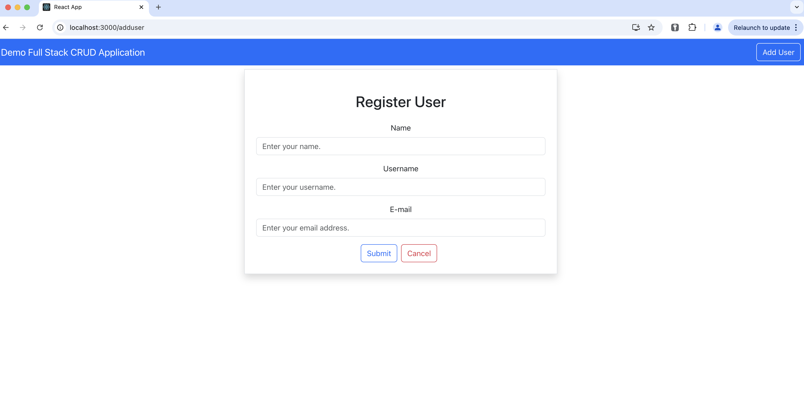

# crud-demo

Built a Full Stack Web Application that provides CRUD functionalities. Used Spring Boot for the backend and React for the frontend. Decent learning experience, def getting a hang of this.

## Features

- **Spring Boot Backend:**
  - RESTful API endpoints.
  - Database integration with Spring Data JPA.

- **React Frontend:**
  - Responsive and dynamic user interface.
  - State management using React Hooks.
  - Integration with backend APIs.

- **Full Stack:**
  - Seamless integration between the backend and frontend.
  - Modern and efficient development workflow.

## Prerequisites

Before you begin, ensure you have met the following requirements:

- Java Development Kit (JDK) installed.
- Node.js and npm installed.
- Used VS Code for React frontend, IntelliJ for Spring Boot backend

## Getting Started

Follow these steps to set up and run the application locally:

1. Clone the repository:

   ```bash
   git clone https://github.com/saurxbh/crud-demo.git

## Execution




